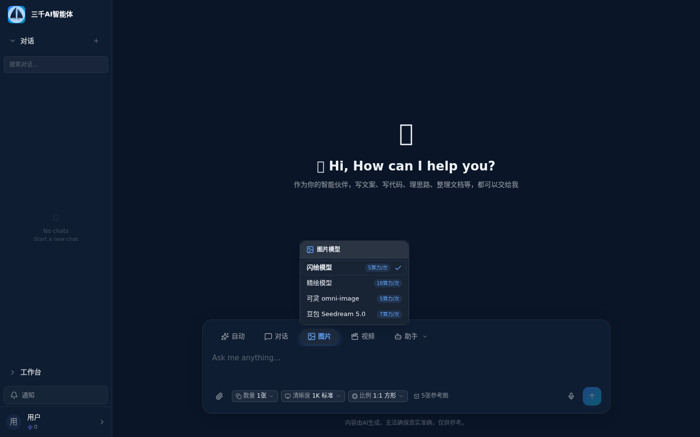
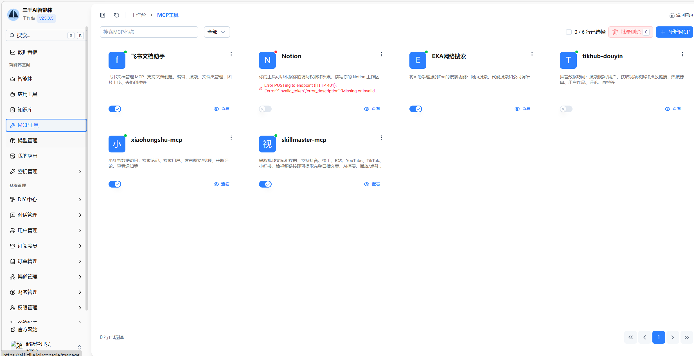
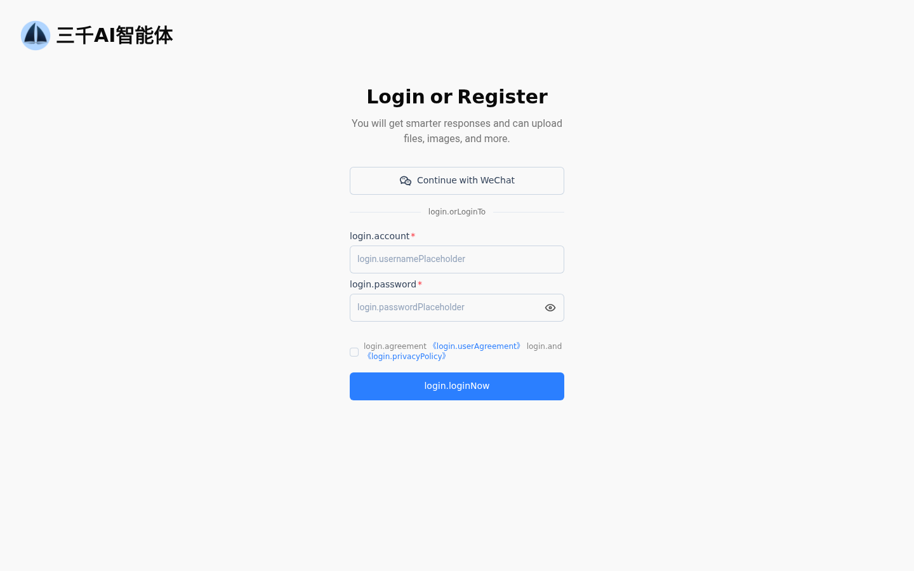
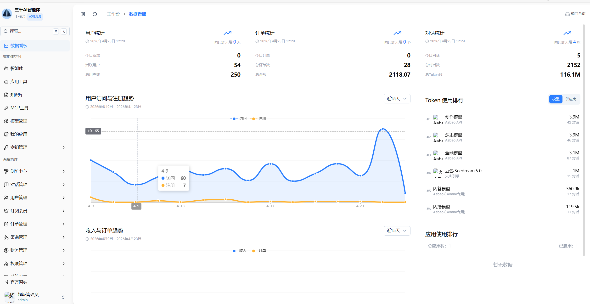

<div align="center">

# 三千AI智能体

### 面向自媒体和内容团队的一站式 AI 工作台

**AI 画布工作流 · 口播IP运营 · 主流图片视频模型聚合 · 私有化部署**

[]()
[]()
[]()
[]()

[**🚀 在线演示**](https://ai1.zijie.lol) &nbsp;·&nbsp; [🎬 演示视频](https://ai1.zijie.lol/demo.mp4) &nbsp;·&nbsp; [📖 完整产品文档](./docs/product.md) &nbsp;·&nbsp; [💬 商务联系](#联系方式)

<video src="https://ai1.zijie.lol/demo.mp4" controls muted playsinline width="720" poster="./screenshots/02-chat-home.png">
  您的浏览器不支持内嵌视频，<a href="https://ai1.zijie.lol/demo.mp4">点此查看演示视频</a>。
</video>


</div>

---

## 一句话介绍

**三千AI智能体是一款面向自媒体和内容团队的一站式 AI 工作台,核心功能是 AI 画布多步工作流、口播IP工作台、主流图片/视频模型聚合,支持私有化部署与买断授权。**

做自媒体、管 MCN、想做 AI 工具变现的,一个账号管完对话、生图、生视频、口播视频合成、内容 IP 运营 —— 不用再同时订阅 5 款 AI 工具。

---

## ✨ 三个核心能力

### 1️⃣ AI 画布 · 拖拽式多步工作流

**一条脚本自动变成片** —— 在同一个画布上串起 **脚本 → 配图 → 配音 → 合成口播视频**,不用切工具、不用复制粘贴。

**20 个内置节点**覆盖全链路:

| 类别 | 节点 |
|---|---|
| 🎨 图像处理 | 图像生成 · 局部重绘 · 画面扩展 · 超分 · 白底图 · 自动蒙版 · 局部替换 · 写实化 · 融合 |
| 🎬 视频处理 | 文生视频 · 视频剪辑 · 视频合成 · 分镜串联 · 首尾帧 · 去水印 |
| 👤 数字人 | 口型同步 · 虚拟数字人生成 |
| 🔧 其他 | 音频处理 · 文本处理 |

**两种批量模式**:
- **ZIP 模式** —— 一次跑一批任务
- **CROSS 模式** —— 参数交叉组合批量出图


---

### 2️⃣ 口播IP工作台 · 内容飞轮 SOP

**不是单次生成,是帮你持续产出**。从 IP 定位 → 选题 → 脚本 → 数据复盘,闭环跑起来。

| 模块 | 核心能力 |
|---|---|
| 💡 **灵感爆发** | 素材转选题 · AI 基于定位智能推荐 · 14+ 社媒平台赛道搜索 |
| ✍️ **文案工坊** | 12 种风格标签一键切换 · Copilot 段落润色 · 脚本质量评分 |
| 📊 **数据回流** | 视频数据自动追踪 · AI 复盘分析 · 评论区自动转下一期选题 |
| 🎯 **定位引擎** | IP 人设建档 · 赛道数据驱动 · **「立权威·建信任·做转化」三轮配比可视化** |
| 🧠 **知识图谱** | 知识原子库 · AI 提炼观点 · 内容覆盖度分析 |


---

### 3️⃣ 主流图片/视频模型全接入

**一个对话框,切模型,不用来回登几家平台**。

| 类型 | 支持模型 |
|---|---|
| 💬 **LLM 对话** | GPT · Claude · Gemini · Kimi · 深度求索 · 智谱 GLM · 通义千问 · 文心一言 · xAI Grok |
| 🖼️ **文生图** | 闪绘 · 精绘 · 可灵 omni-image · 豆包 Seedream 5.0 |
| 🎥 **文生视频** | 创影 · Kling V3 · Kling 动作控制 · 豆包 Seedance 2.0 Pro / 2.0 / 1.x Lite |



---

## 🏗️ 技术架构

```
用户 → Nginx (SSL) → Docker Compose
  ├── NestJS API     :4090 · PM2
  ├── Nuxt 4 SSR/SPA :3000 · PM2
  ├── PostgreSQL 17.6 (pgvector + zhparser)
  └── Redis 8.2.2 + BullMQ
```

**服务器最低配置**:4 核 · 8GB RAM · 40GB 磁盘 · Linux / macOS
**一键部署**:`docker compose up -d` · 10 分钟内上线

---

## 💼 典型场景

### 场景 1 · 自媒体批量出口播视频

每天要出 3-5 条口播视频,以前 4 小时,现在 40 分钟:

1. 口播IP工作台建 IP 档案,绑定赛道关键词
2. 系统每天从抖音 / 小红书 / YouTube 拉爆款
3. 一键匹配选题,AI 生脚本
4. 画布工作台:脚本 → 配音 → 数字人视频全自动合成

### 场景 2 · MCN 多账号矩阵运营

管理 10+ 账号 · 每个账号独立 IP 档案 · 统一后台管理 · 评论区自动提炼下期选题。

### 场景 3 · AI 工具创业 / 代理商

买授权 / 源码 · DIY 中心改品牌 · 接自己的支付渠道 · 按自己定价运营。

---

## 💰 授权方案

| 档位 | 价格 | 说明 |
|---|---|---|
| **授权** | ~~¥2980~~ **¥2280**(限时) | 仅授权,不含源码,用发行包部署 |
| **包搭建** | **¥3980** | 授权 + 代搭建上线 |
| **开源源码** | **¥13800** | 全部源码开放,可二次开发 |

**共同权益**:
- ✅ 绑域名不绑服务器,服务器可随时迁移
- ✅ 并发用户数不限
- ✅ 版本更新免费终身
- ✅ 初次部署协助(远程 1 小时内上线)

> 💬 具体方案可按需求细聊,加商务微信 **q2026560558** 沟通

---

## ❓ FAQ

<details>
<summary><b>Q:买断后 AI 模型费用谁付?</b></summary>

模型 API 费用自行承担。后台「模型配置」填入自己的 API Key,可按自己的成本设置每个模型的算力消耗和会员定价。
</details>

<details>
<summary><b>Q:能换成自己的品牌 LOGO 和名字吗?</b></summary>

可以。后台 DIY 中心直接换 LOGO、名称、主题色。买开源源码档位可做代码级定制。
</details>

<details>
<summary><b>Q:支持国产大模型吗?</b></summary>

支持深度求索、智谱 GLM、Kimi、豆包、通义千问、文心一言等主流国产模型。
</details>

<details>
<summary><b>Q:数据安全怎么保障?</b></summary>

私有化部署,全部数据在你自己的服务器和数据库上,不经过任何第三方。
</details>

<details>
<summary><b>Q:服务器需要备案吗?</b></summary>

国内访问需要备案(常规建站要求),系统本身没有额外限制。
</details>

<details>
<summary><b>Q:服务器可以换吗?</b></summary>

License 绑域名不绑服务器。换服务器不需重签;换域名联系重签。
</details>

<details>
<summary><b>Q:支持 MCP 协议吗?</b></summary>

支持。已内置飞书文档、Notion、EXA 搜索、抖音/小红书数据、视频文案提取等 MCP 工具,可按协议扩展。


</details>

<details>
<summary><b>Q:适合什么样的团队?</b></summary>

- ✅ 每天出 3+ 条内容的自媒体
- ✅ 管 5+ 账号的 MCN
- ✅ 想做 AI 工具变现的创业者
- ✅ 重视数据隐私的企业内部
- ❌ 每周只出 1-2 条、不想折腾服务器的轻度用户
</details>

---

## 📸 产品截图

### 用户端

| 登录注册 | 主对话界面 | 助手市场 |
|---|---|---|
|  |  |  |

### 画布工作台

| 项目列表 | 画布编辑器 |
|---|---|
|  |  |

### 口播IP工作台

| 频道管理 | 灵感爆发 | 文案工坊 |
|---|---|---|
|  |  |  |

| 数据回流 | 定位引擎 |
|---|---|
|  |  |

### 管理后台

| 数据看板 | Agent 管理 | 用户管理 |
|---|---|---|
|  |  |  |

| DIY 装修 | MCP 工具 |
|---|---|
|  |  |

---

## 📬 联系方式

- 🌐 **演示站点**:<https://ai1.zijie.lol>
- 💬 **商务微信**:`q2026560558`
- 🏢 **厂商**:小妍妍网络科技
- 📦 **当前版本**:v25.3.5(2026-04 更新)

**适合人群**:自媒体团队 · MCN 机构 · AI 工具创业者 · 企业内部 AI 平台建设方 · 代运营服务商

---

## 📄 授权声明

本仓库**仅用于产品展示**,存放产品文档、截图、部署指南示例,**不包含产品源码**。

产品采用商业授权模式,详见 [授权方案](#授权方案) 章节。

- ❌ 禁止公开发布源码
- ❌ 禁止转售授权
- ❌ 禁止搭建竞品 SaaS 对外销售

---

<div align="center">

**如果这个项目对你有启发,请点个 ⭐ Star 支持一下**

© 2026 小妍妍网络科技 · 三千AI智能体 · 保留所有权利

</div>
