<div align="center">

# 三千AI智能体

### 面向自媒体和内容团队的一站式 AI 工作台

**集成主流 LLM · 文生图 · 文生视频 · 画布工作流 · 口播IP 运营 · 私有化部署**

[]()
[]()
[]()
[]()

[**🚀 在线演示**](https://ai1.zijie.lol) &nbsp;·&nbsp; [🎬 演示视频](https://ai1.zijie.lol/demo.mp4) &nbsp;·&nbsp; [📖 完整产品文档](./docs/product.md) &nbsp;·&nbsp; [💬 商务联系](#联系方式)

> 🧪 **演示账号**:`demo` / `Demo123456` &nbsp;·&nbsp; 进 https://ai1.zijie.lol 直接体验

<video src="https://ai1.zijie.lol/demo.mp4" controls muted playsinline width="720" poster="./screenshots/02-chat-home.png">
  您的浏览器不支持内嵌视频，<a href="https://ai1.zijie.lol/demo.mp4">点此查看演示视频</a>。
</video>

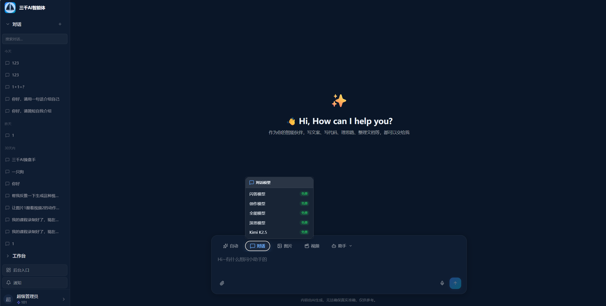

</div>

---

## 一句话介绍

**三千AI智能体是一款面向自媒体和内容团队的一站式 AI 工作台。一个账号集成 OpenAI、Gemini、Claude、豆包、Kimi、Qwen 等顶级模型,支持智能对话、图片生成、视频创作、画布工作台、口播 IP 工作台等能力,PC 与 H5 双端原生适配,支持私有化部署与买断授权。**

做自媒体、管 MCN、想做 AI 工具变现的团队 —— 一个账号管完对话、生图、生视频、口播视频合成、内容 IP 长期运营、作品广场互动。

---

## ✨ 六大核心能力

### 1️⃣ AI 画布 · 拖拽式多步工作流

**一条脚本自动变成片** —— 在同一个画布上串起 **脚本 → 配图 → 配音 → 合成口播视频**,不用切工具、不用复制粘贴。

**20+ 内置节点**覆盖全链路:

| 类别 | 节点 |
|---|---|
| 🎨 图像处理 | 图像生成 · 局部重绘 · 画面扩展 · 超分 · 白底图 · 自动蒙版 · 局部替换 · 写实化 · 融合 |
| 🎬 视频处理 | 文生视频 · 视频剪辑 · 视频合成 · 分镜串联 · 首尾帧 · 去水印 |
| 👤 数字人 | 口型同步 · 虚拟数字人生成 |
| 🔧 其他 | 音频处理 · 文本处理 |

**两种批量模式**:
- **ZIP 模式** —— 一次跑一批任务
- **CROSS 模式** —— 参数交叉组合批量出图

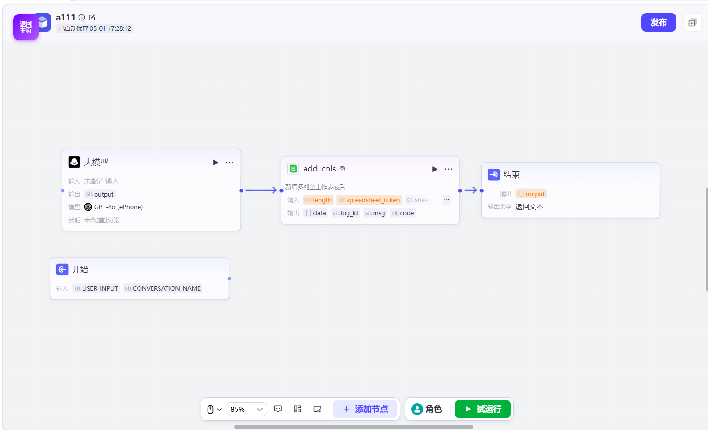

---

### 2️⃣ 口播IP工作台 · 内容飞轮 SOP

**不是单次生成,是帮你持续产出**。从 IP 定位 → 选题 → 脚本 → 数据复盘,闭环跑起来。

| 模块 | 核心能力 |
|---|---|
| 💡 **灵感爆发** | 素材转选题 · AI 基于定位智能推荐 · 14+ 社媒平台赛道搜索 |
| ✍️ **文案工坊** | 多种风格脚本模板一键切换 · Copilot 段落润色 · 脚本质量评分 |
| 📊 **数据回流** | 视频数据自动追踪 · AI 复盘分析 · 评论区自动转下一期选题 |
| 🎯 **定位引擎** | IP 人设建档 · 赛道数据驱动 · **「立权威·建信任·做转化」三轮配比可视化** |
| 🧠 **知识图谱** | 知识原子库 · AI 提炼观点 · 内容覆盖度分析 |

**覆盖 16 个领域 · 5+ 内容类型**:产品测评、亲子育儿、保险规划、健身营养、知识观点、口播短视频、知识号 等。

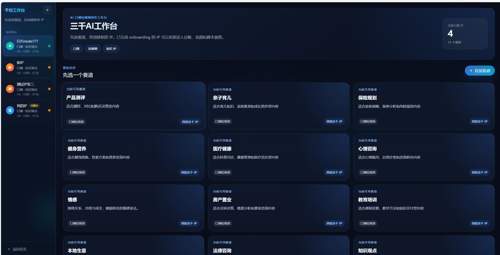

---

### 3️⃣ 多模型聚合对话 · 17+ 供应商统一接入

**一个对话框,一键切模型,无需在多家平台间来回登**。

| 类型 | 覆盖能力 |
|---|---|
| 💬 **LLM 对话** | OpenAI · Anthropic Claude · Google Gemini · 深度求索 · 智谱 GLM · Kimi · 通义千问 · 文心一言 · xAI Grok |
| 🖼️ **文生图** | 闪绘 · 精绘 · 闪答 · 豆包 Seedream 5.0 · 火山引擎 · 可灵 omni-image |
| 🎥 **文生视频** | 创影 · Sora · Veo · Grok Video · Kling V3 · Kling 动作控制 · 豆包 Seedance 2.0 Pro / 2.0 / 1.x Lite |
| 🔄 **统一聚合** | 后端聚合 17 个供应商通道(Aabao 全模态 · Aabao Sora 按次 · Aabao Gemini · ePhone API · ePhone Kling · ePhone Sora · 火山引擎 · 智谱 AI · 文心一言 等),同一对话框切换 |

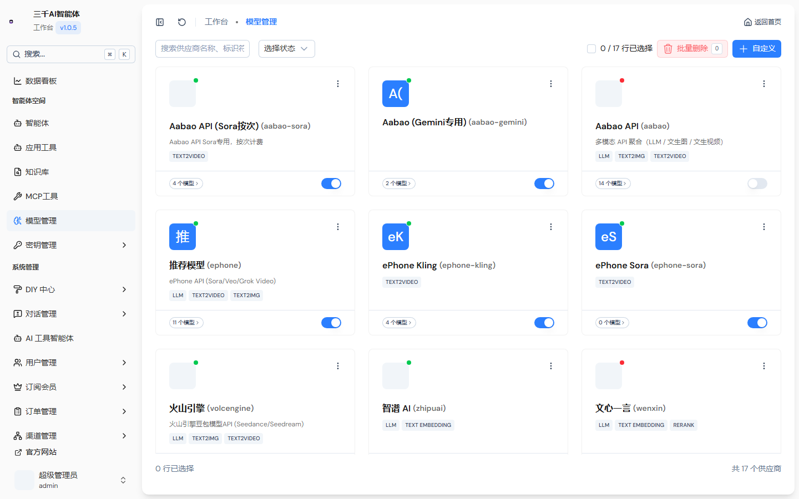

---

### 4️⃣ 智能体广场 · 持续上新的 AI 工具集

**社区共建 + 官方持续上新**。智能体广场提供开箱即用的多场景 AI 工具,登录即用,无需配置。

#### 🛠️ 工具智能体 · 输入素材,自动完成一整套生成任务

| 智能体 | 能力 | 标签 |
|---|---|---|
| 🎬 **智能视频** | 文字描述 + (可选)参考视频或参考图,生成 9:16 短视频 · **有参考 = 按你的素材风格 · 无参考 = 纯创意** | `AI 视频` |
| 🛍️ **电商一键带货** | 商品主图 → 自动生成带货视频 · 可选「带模特」模式上传模特图,生成模特展示效果 | `电商` `带货` |

#### 🤖 操盘手智能体

- **三千AI操盘手** —— AI 内容创作全流程助手:**IP 诊断 → 选题 → 脚本生成**

#### ✨ 持续上新中

新场景智能体陆续接入,管理员也可在后台自由创建任意 Agent,配置专属提示词、知识库、MCP 工具 —— 智能体列表完全自定义。

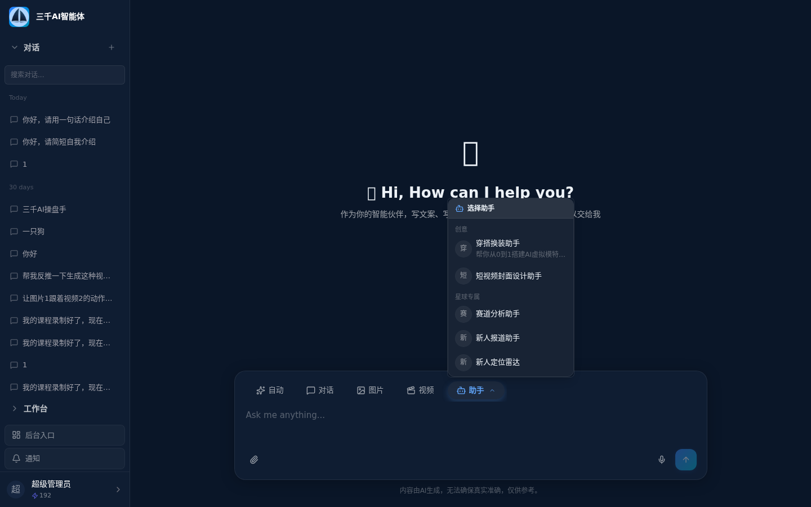

---

### 5️⃣ 作品广场 · 创作即分享(NEW)

**让团队和用户互相看到作品,激发灵感**。所有用户的画布项目、口播脚本、生图、生视频都可一键发布到作品广场,带 ♡ 互动。

- 📋 **多类型筛选**:全部 / 口播脚本 / 画布项目 / 🎬 视频 / 🖼️ 图片
- 👁️ **看过计数**:每件作品独立统计互动
- 👤 **作者标签**:支持作者 + 发布时间展示
- 🔍 **搜索定位**:关键词快速找到目标作品

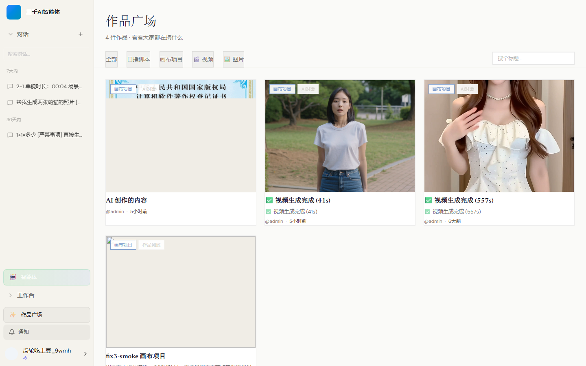

---

### 6️⃣ 全网热搜 · 选题即用(v1.0.5)

**选题不愁** —— 抖音 / 微博 / B站 / 快手 / 小红书 等主流平台实时热搜,**每整点自动刷新**,直接嵌入工作台首屏。

| 维度 | 能力 |
|---|---|
| 📡 **数据源** | 抖音热搜 · 微博热搜榜 · B 站热搜 · 快手热榜 · 小红书热榜 · 视频号热门话题 (6 平台全部接入)|
| ⏱️ **更新频率** | 每整点小时自动 cron 拉取 + 可手动刷新 |
| 🎯 **工作台直达** | 工作台顶部「现在大家在聊」teaser 一行展示,点击进入完整热点列表 |
| 📋 **一键复制** | 单条热搜直接复制标题到剪贴板,粘到 IP 文案工坊立即出脚本 |
| 🔑 **后台密钥可视化配置** | TikHub API Key 在「后台 - 密钥管理」可视化管理,5 分钟内生效,无需改 .env |


---

## 💻 PC 与 H5 双端原生适配

**桌面端 + 移动端,同一账号,无缝切换**。重型任务(画布编辑、后台管理)在 PC 端体验最佳,日常对话与查看创作随手在手机上完成。

### 桌面端 (PC)

| 后台数据看板 | 智能体广场 (PC) | 我的创作 (PC) |
|:---:|:---:|:---:|
| 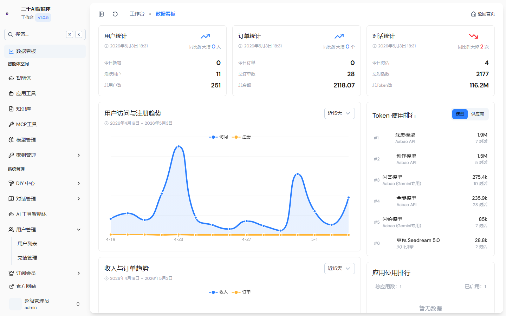 | 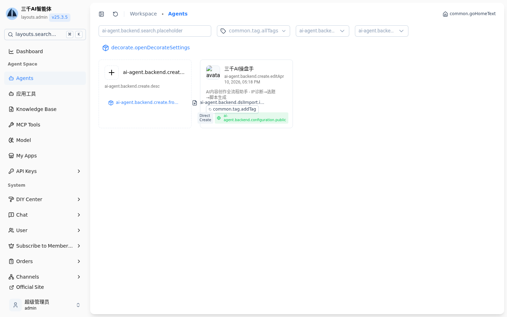 | 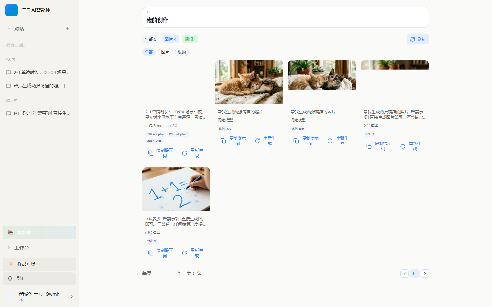 |

### 移动端 (H5)

| 主对话 (H5) | 口播IP工作台 (H5) | 全网社媒热搜 (H5) |
|:---:|:---:|:---:|
| 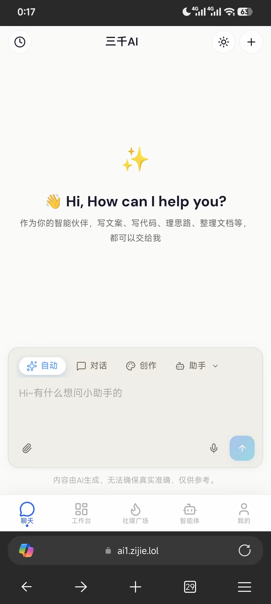 | 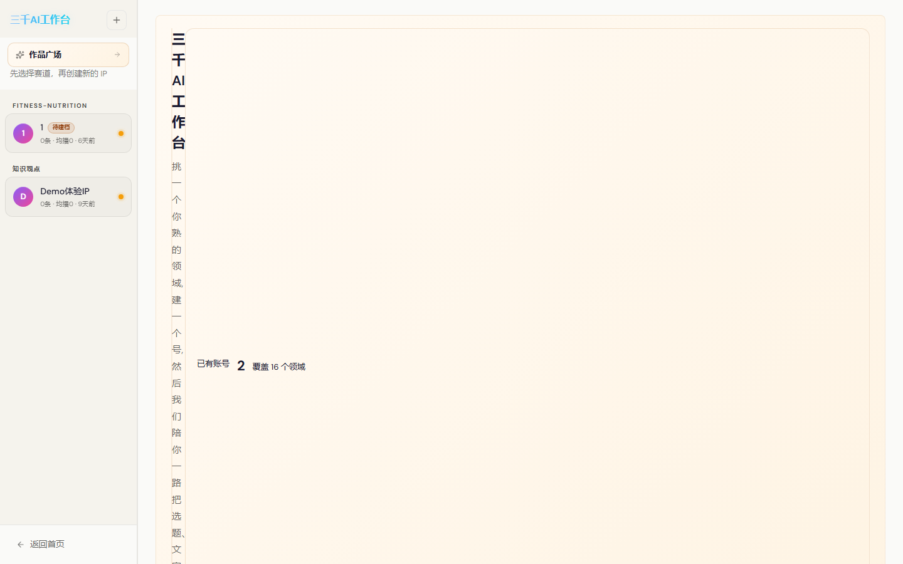 | 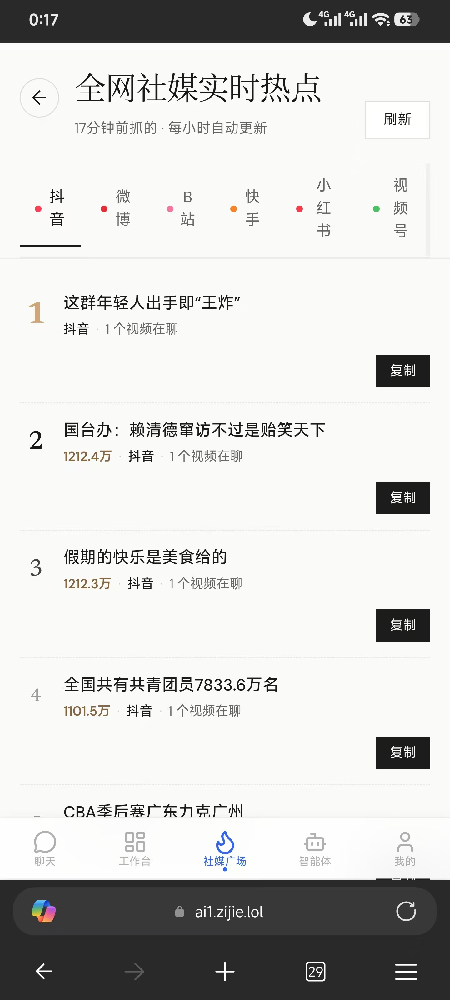 |

| 智能体广场 (H5) | 作品广场 (H5) | 个人中心 (H5) |
|:---:|:---:|:---:|
| 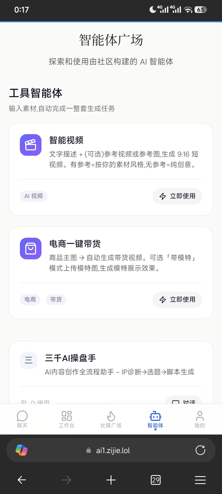 | 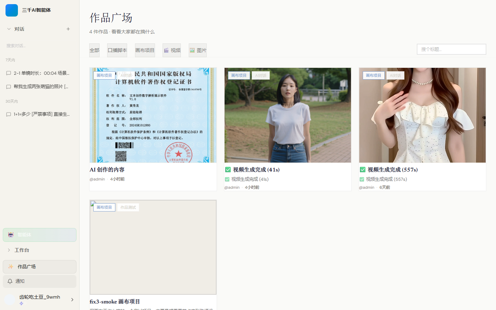 | 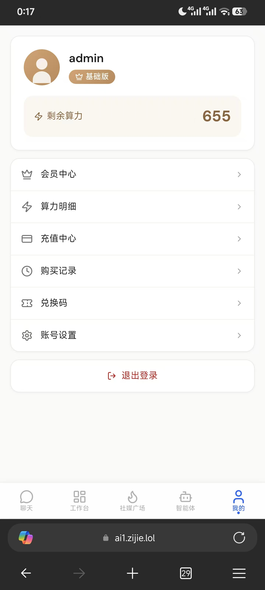 |

| 通知中心 (H5) | 知识库 (H5) | 用户协议 (PC) |
|:---:|:---:|:---:|
| 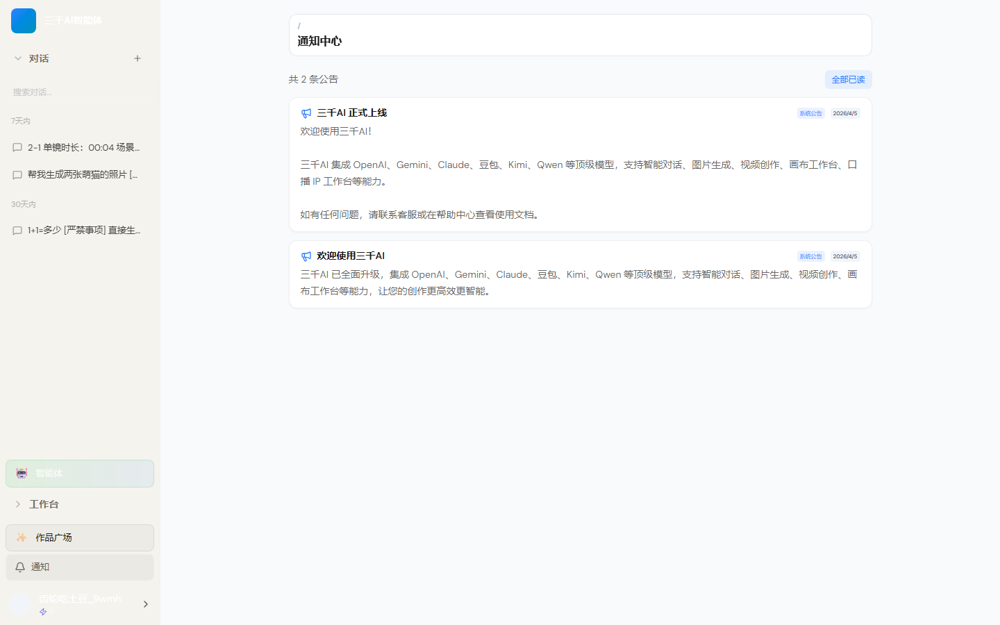 | 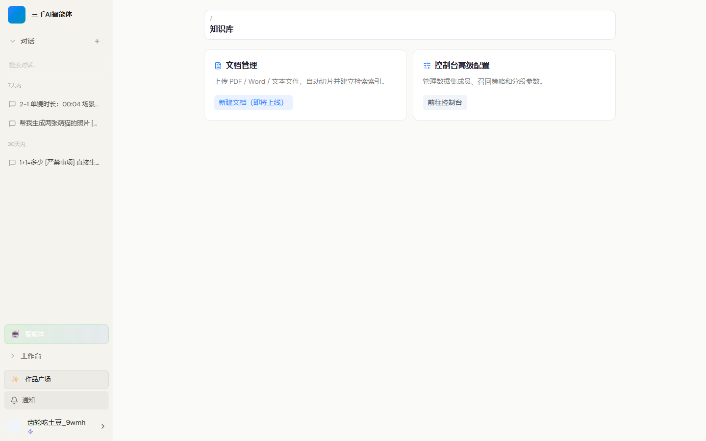 | 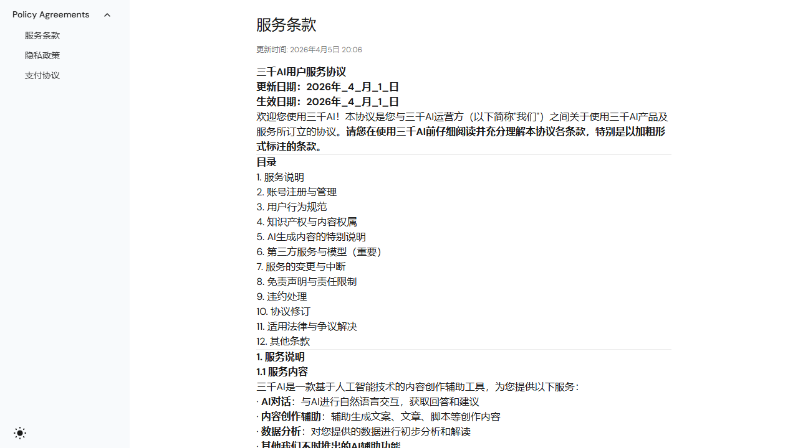 |

---

## 🎛️ 完善的管理后台

**所有运营动作可视化,从用户到模型,从订单到内容,一屏掌控**。

### 数据看板 · 实时洞察

用户 / 订单 / 对话 / Token 全维度统计,近 15 天访问与注册趋势 + 收入与订单趋势 + Token 使用排行(模型/供应商双维度切换),即开即看。


### 智能体管理

支持「从模板创建 / 导入 DSL / 直接创建」三种方式,公开 / 编辑 / 导出 / 删除一应俱全。

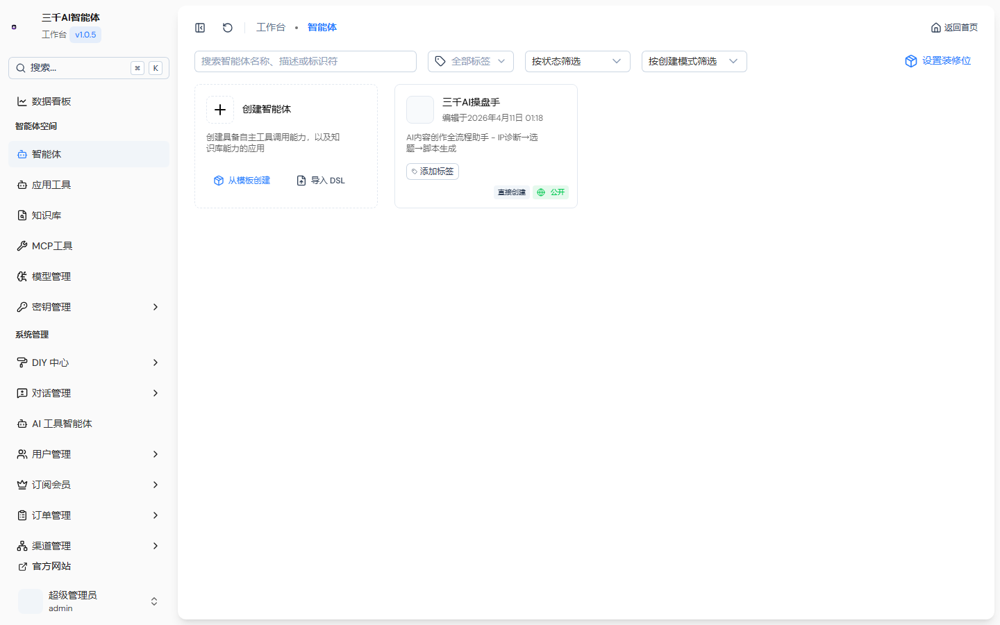

### MCP 工具 · 6 项内置 + 可扩展

- 🗂️ **飞书文档助手** —— 文档创建 / 编辑 / 搜索 / 文件夹管理 / 图片上传 / 表格创建
- 📝 **Notion** —— 按访问权限读写 Notion 工作区
- 🔍 **EXA 网络搜索** —— 网页搜索、代码搜索、公司调研
- 🎵 **TikHub Douyin** —— 抖音数据访问:搜索视频/用户、播放数据、热搜榜单、作品列表
- 📕 **小红书 MCP** —— 笔记搜索、用户搜索、发布图文/视频、获取评论
- 🎬 **Skillmaster MCP** —— 视频文案提取(抖音 / 快手 / B站 / YouTube / TikTok / 小红书)

支持自定义新增 MCP,按协议扩展。

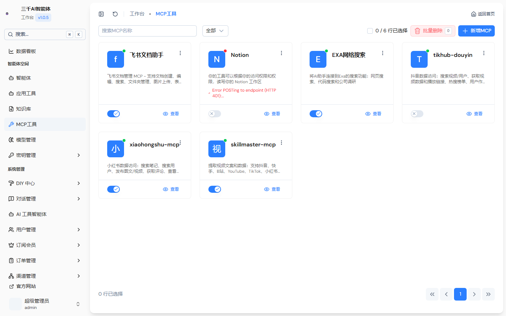

### 模型管理 · 17 个供应商统一接入

Aabao 三档(全模态 / Sora 按次 / Gemini 专用)· ePhone 三档(API / Kling / Sora)· 火山引擎 · 智谱 AI · 文心一言 · 等 17 家供应商统一接入,后台可视化开关每个通道、绑定 API Key、配置算力扣费规则。


### DIY 中心 · 三件套换肤

| 模块 | 能力 |
|---|---|
| 🎨 **微页面** | 装修自定义页面,支持批量管理 |
| 🧭 **前台导航** | 自定义菜单结构与跳转链接 |
| 🧰 **应用中心** | 把官方智能体、自定义工具组合上架 |

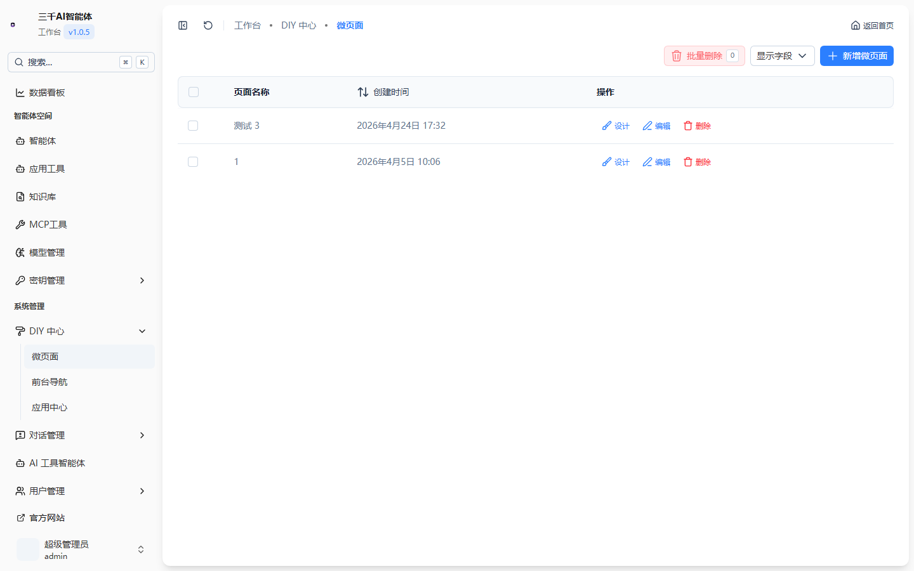

### 对话管理

按用户、按时间维度查看所有对话历史,Token 消耗 + 积分消耗 + 模型来源一表查询,支持批量管理。

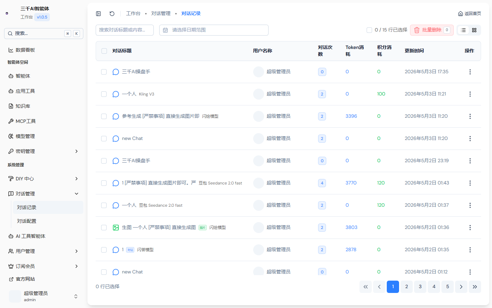

### 系统设置 · 8 项分区配置

登录设置 · 政策协议 · 网站信息 · 支付配置 · 存储配置 · 公告管理 · 站点装修 · 算力扣费规则 —— 全部可视化配置,无需改配置文件。

---

## 🏗️ 技术架构

```
用户 → Nginx (HTTPS) → 三千AI 应用层
  ├── NestJS API + Nuxt 4 SSR/SPA   :4090
  ├── PostgreSQL 17.6 (pgvector + zhparser)
  ├── Redis 8.2.2 + BullMQ
  └── Docker Compose 一键编排
```

**服务器最低配置**:4 核 · 8GB RAM · 40GB 磁盘 · Linux / macOS
**一键部署**:`docker compose up -d` · 10 分钟内上线
**HTTPS**:支持 acme.sh + Let's Encrypt 自动签发与续期

---

## 💼 典型场景

### 场景 1 · 自媒体批量出口播视频

每天要出 3-5 条口播视频,从 4 小时压到 40 分钟:

1. 口播IP工作台建 IP 档案,绑定赛道关键词
2. 系统每天从抖音 / 小红书 / YouTube 拉爆款
3. 一键匹配选题,AI 生脚本
4. 画布工作台:脚本 → 配音 → 数字人视频全自动合成
5. 发布作品广场,看互动数据

### 场景 2 · MCN 多账号矩阵运营

管理 10+ 账号 · 每个账号独立 IP 档案 · 统一后台管理 · 评论区自动提炼下期选题 · 多账号 Token 消耗一表清。

### 场景 3 · AI 工具创业 / 代理商

买授权 / 源码 · DIY 中心改品牌 · 接自己的支付渠道 · 按自己定价运营 · 17 个模型供应商任意开关。

### 场景 4 · 企业内部 AI 平台

私有化部署 · 数据全在自己的服务器 · 微信一键登录 · 知识库内化企业知识 · MCP 接入飞书 / Notion 工作流。

---

## 💰 授权方案

| 档位 | 价格 | 说明 |
|---|---|---|
| **授权** | ~~¥2980~~ **¥2280**(限时) | 仅授权,不含源码,用发行包部署 |
| **包搭建** | **¥3980** | 授权 + 代搭建上线 |
| **开源源码** | **¥13800** | 全部源码开放,可二次开发 |

**共同权益**:
- ✅ 绑域名不绑服务器,服务器可随时迁移
- ✅ 并发用户数不限
- ✅ 版本更新免费终身
- ✅ 初次部署协助(远程 1 小时内上线)

> 💬 具体方案可按需求细聊,加商务微信 **q2026560558** 沟通

---

## ❓ FAQ

<details>
<summary><b>Q:买断后 AI 模型费用谁付?</b></summary>

模型 API 费用自行承担。后台「模型管理」+「密钥管理」可视化填入自己的 API Key,可按自己的成本设置每个模型的算力消耗和会员定价。
</details>

<details>
<summary><b>Q:能换成自己的品牌 LOGO 和名字吗?</b></summary>

可以。后台 DIY 中心三件套(微页面 / 前台导航 / 应用中心)直接换 LOGO、名称、主题色与菜单结构。买开源源码档位可做代码级深度定制。
</details>

<details>
<summary><b>Q:支持国产大模型吗?</b></summary>

支持深度求索、智谱 GLM、Kimi、豆包、通义千问、文心一言、Aabao API 聚合 等主流国产模型。
</details>

<details>
<summary><b>Q:数据安全怎么保障?</b></summary>

私有化部署,全部数据在你自己的服务器和数据库上,不经过任何第三方。
</details>

<details>
<summary><b>Q:服务器需要备案吗?</b></summary>

国内访问需要备案(常规建站要求),系统本身没有额外限制。
</details>

<details>
<summary><b>Q:服务器可以换吗?</b></summary>

License 绑域名不绑服务器。换服务器不需重签;换域名联系重签。
</details>

<details>
<summary><b>Q:支持 MCP 协议吗?</b></summary>

支持。已内置 6 个 MCP 工具:飞书文档、Notion、EXA 搜索、TikHub Douyin、小红书 MCP、Skillmaster 视频文案提取。可按 MCP 协议自定义扩展。


</details>

<details>
<summary><b>Q:PC 端和 H5 端都有吗?</b></summary>

有。PC 与 H5 双端原生适配,同一账号无缝切换。重型任务(画布编辑、后台管理)在 PC 端体验最佳,日常对话与查看作品广场在手机上随手完成。
</details>

<details>
<summary><b>Q:适合什么样的团队?</b></summary>

最适合:
- ✅ 每天出 3+ 条内容的自媒体团队
- ✅ 管 5+ 账号的 MCN 机构
- ✅ 想做 AI 工具变现的创业者
- ✅ 重视数据隐私、希望平台沉淀在自己服务器的企业
- ✅ 帮客户搭建 AI 工具的代运营服务商
</details>

---

## 📸 产品截图

### 用户端 · PC

| 主对话界面 | 我的创作 | 作品广场 |
|---|---|---|
|  |  |  |

| 用户协议 | 智能体广场 | 助手市场 |
|---|---|---|
|  |  |  |

### 用户端 · H5

| 主对话 | 工作台 | 智能体广场 |
|---|---|---|
|  |  |  |

| 全网社媒热搜 | 作品广场 | 个人中心 |
|---|---|---|
|  |  |  |

| 通知中心 | 知识库 | 登录 |
|---|---|---|
|  |  | 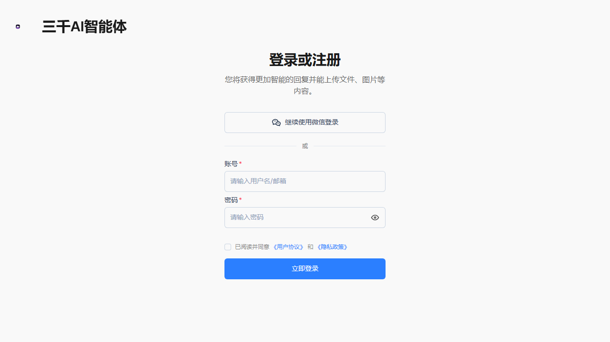 |

> **输入模式按端自适应**:PC 端展开为「自动 / 对话 / 图片 / 视频 / 助手」5 个独立入口,H5 移动端合并为「自动 / 对话 / 创作 / 助手」4 个,创作模式内部一键切换图片/视频。

### 画布工作台

| 项目列表 | 画布编辑器 | 顶栏 logo |
|---|---|---|
| 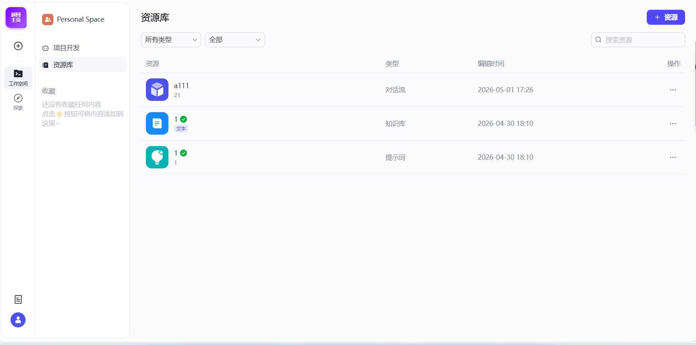 |  | 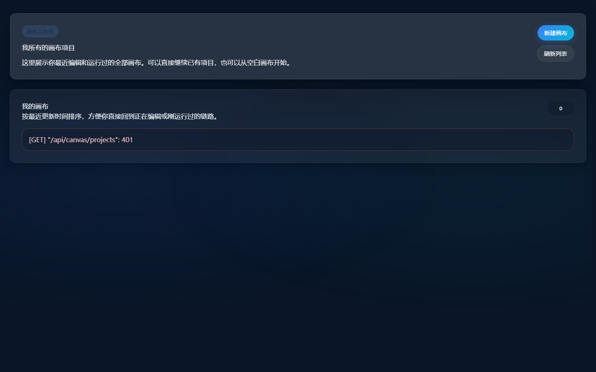 |

### 口播IP工作台

| 频道管理 | 灵感爆发 | 文案工坊 |
|---|---|---|
|  | 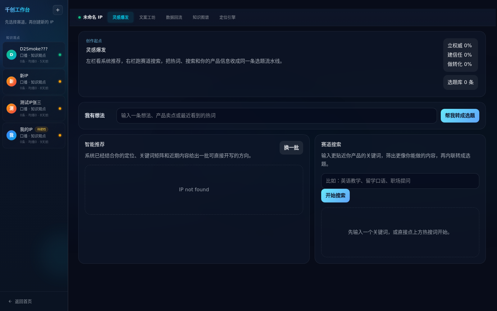 | 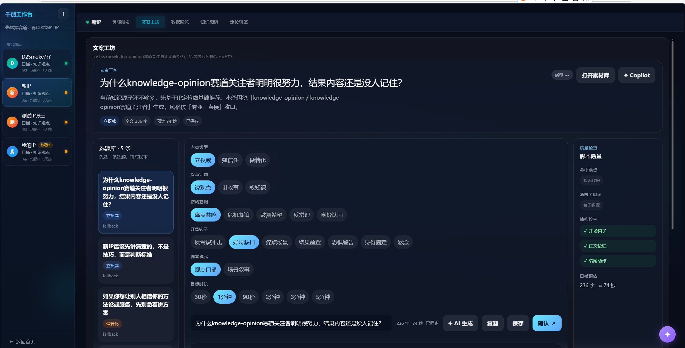 |

| 数据回流 | 定位引擎 | 知识图谱 |
|---|---|---|
| 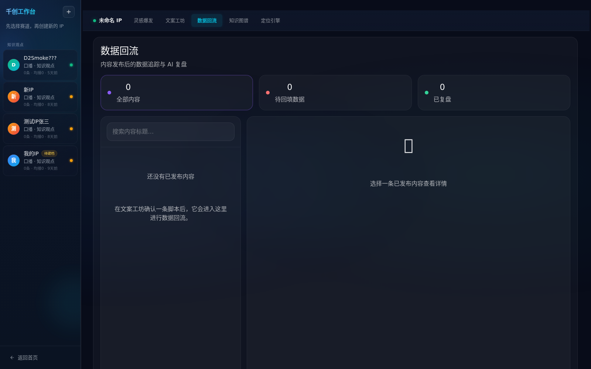 | 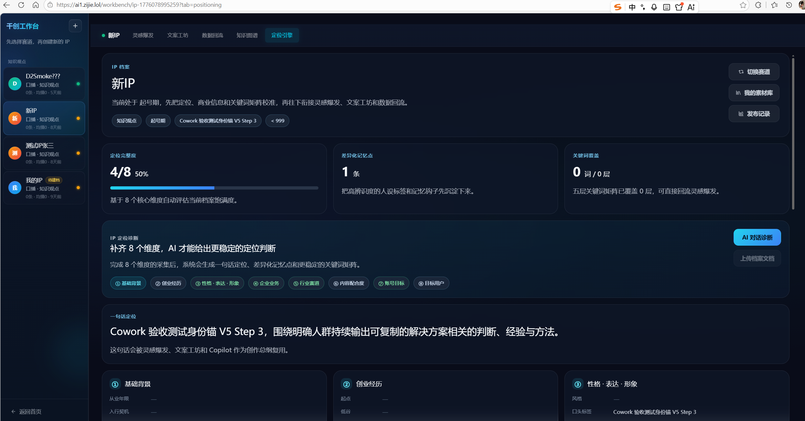 | 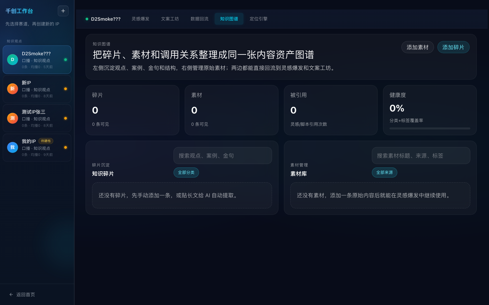 |

### 管理后台

| 数据看板 | Agent 管理 | 用户管理 |
|---|---|---|
|  |  | 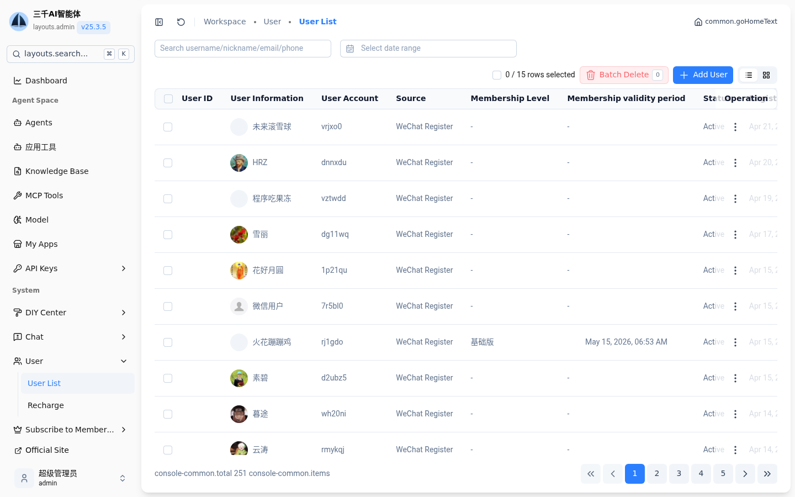 |

| 模型管理 (17 供应商) | MCP 工具 (6 内置) | DIY 中心 |
|---|---|---|
|  |  |  |

| 对话管理 | DIY 装修 |
|---|---|
|  | 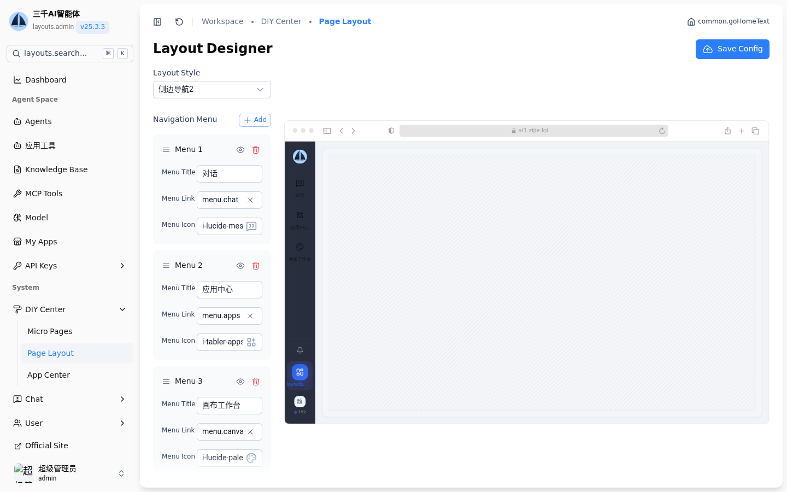 |

---

## 📬 联系方式

- 🌐 **演示站点**:<https://ai1.zijie.lol>
- 🧪 **演示账号**:`demo` / `Demo123456`
- 💬 **商务微信**:`q2026560558`
- 🏢 **厂商**:小妍妍网络科技
- 📦 **当前版本**:**v1.0.5**(2026-05 更新)

**适合人群**:自媒体团队 · MCN 机构 · AI 工具创业者 · 企业内部 AI 平台建设方 · 代运营服务商

---

## 📄 授权声明

本仓库**仅用于产品展示**,存放产品文档、截图、部署指南示例,**不包含产品源码**。

产品采用商业授权模式,详见 [授权方案](#授权方案) 章节。

- ❌ 禁止公开发布源码
- ❌ 禁止转售授权
- ❌ 禁止搭建竞品 SaaS 对外销售

---

<div align="center">

**如果这个项目对你有启发,请点个 ⭐ Star 支持一下**

© 2026 小妍妍网络科技 · 三千AI智能体 · 保留所有权利

</div>
